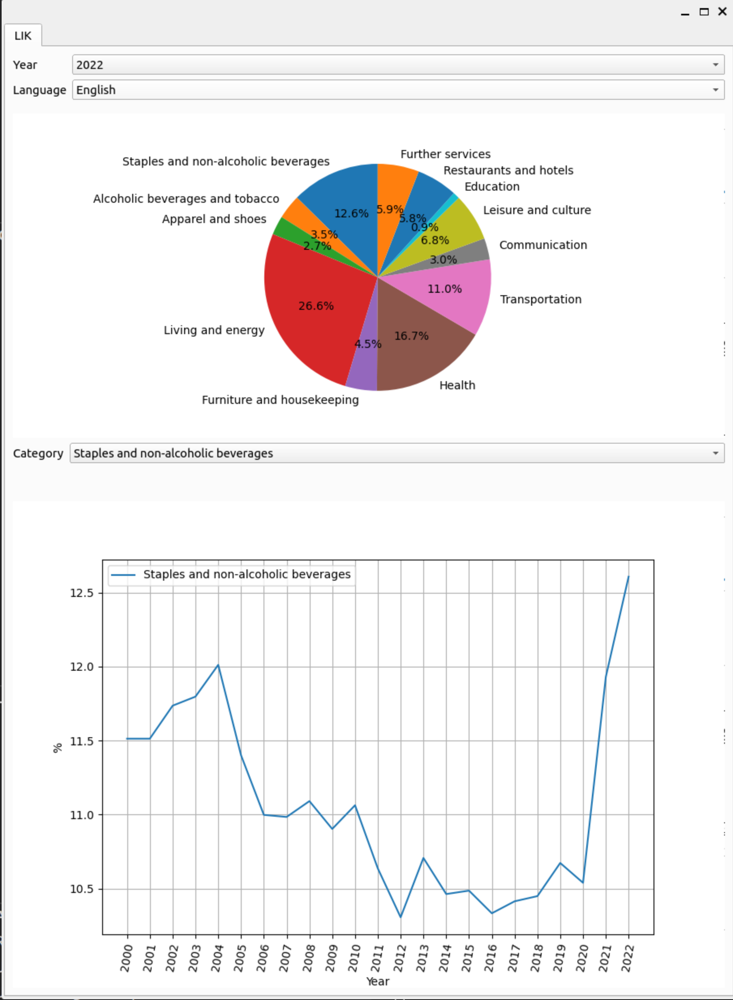

# Inflation tracker (work in progress)
Tries to evaluate different inflation metrics.


# How to install the inflation tracker

Install Python packages requirements:
```sh
pip install -r requirements.txt
```

# How to run the inflation tracker

To start the inflation tracker, run the following:

```sh
python inflation_tracker --lik_data data/lik.xlsx
```


## Swiss inflation shown by LIK
The so-called LIK tab as shown below, visualizes the different weights of the inflation indicator Landesindex der Konsumentenpreise (LIK) for years between 2000 and 2022. The LIK measures as an index measures the price evolution of different goods in Switzerland. The source of this data is a .xlsx data sheet provided by the Swiss authority from [BFS](https://www.bfs.admin.ch/bfs/de/home/statistiken/preise/erhebungen/lik/warenkorb.assetdetail.21484892.html). In the lower plot, you can see the variation of each category's weight over time from 2000 to 2022.





## Create translation files

* Run lupdate:
```sh
make generate_ts_files
```

* Make your translation in the inflation_en.ts file e.g. with [Qt Linguist](https://doc.qt.io/qt-5/linguist-translators.html)

* Run lrelease
```sh
make generate_qm_files
```
