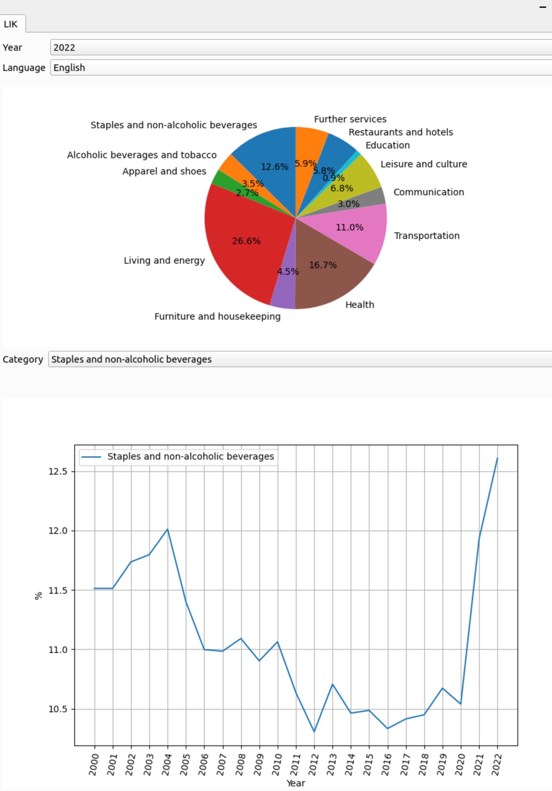
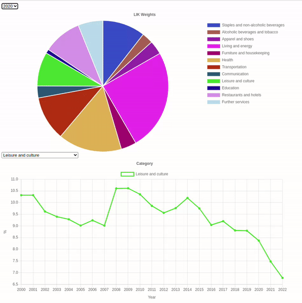

# Inflation tracker (work in progress)

Tries to evaluate different inflation metrics.

# How to install the inflation tracker

Install Python packages requirements:

```sh
pip install -r requirements.txt
```

# How to run the inflation tracker

To start the inflation tracker, run the following:

```sh
python inflation_tracker --lik_data data/lik.xlsx
```

## Swiss inflation shown by LIK

The so-called LIK tab as shown below, visualizes the different weights of the inflation indicator Landesindex der Konsumentenpreise (LIK) for years between 2000 and 2022. The LIK measures as an index measures the price evolution of different goods in Switzerland. The source of this data is a .xlsx data sheet provided by the Swiss authority from [BFS](https://www.bfs.admin.ch/bfs/de/home/statistiken/preise/erhebungen/lik/warenkorb.assetdetail.21484892.html). In the lower plot, you can see the variation of each category's weight over time from 2000 to 2022.



## Running the visualization via webbrowser

To run the visualization GUI from which you can see the weights per year respectively the evolution of each category over period from 2000 to 2022 , open file with webbrowser:
`html/lik.html`

Please note, in order for the webbrowser to be able to access the data in the .json files in the folder `storage_json`, you need to run a local server that serves that files via https requests. To do so, the following worked for me:

- Set up an apache server on Ubuntu PC that serves https requests. Explained in [here](https://techexpert.tips/apache/enable-https-apache/). Please note, I selected the IP address `127.0.0.1` of the apache server. If you select an other IP, you need to adapt this number in the file `html/lik.html` accordingly.
- I had to set Access-Control-Allow-Origin (CORS) Headers in apache according to [this](https://ubiq.co/tech-blog/set-access-control-allow-origin-cors-headers-apache/)
- Finally, I created a soft link in the apache folder that points to the `storage_json` folder of this repo: `sudo ln -s $PWD/html/storage_json_inflation /var/www/html/storage_json_inflation`. Please note, in order for this to work it is required that any parent path in the directory $PWD/html/storage_json needs to be accessible by any other user i.e. `drwxr-x--x`. Please be careful by changing the permission of your folder structure in order to prevent any security breach. If for testing purposes only you can always copy the folder storage_json to `/var/www/html/`.

Afterwards, if you open up `html/lik.html` via your webbrower it should look like below. In the dropdown menu you can select the desired year e.g. 2022 for the pie chart. In the lower plot you can see how the selected category's weight changed over time:



## Create translation files

- Run lupdate:

```sh
make generate_ts_files
```

- Make your translation in the inflation_en.ts file e.g. with [Qt Linguist](https://doc.qt.io/qt-5/linguist-translators.html)

- Run lrelease

```sh
make generate_qm_files
```
