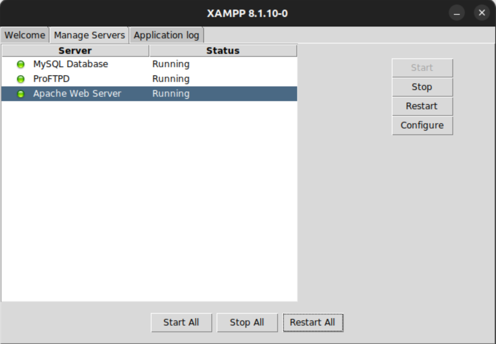
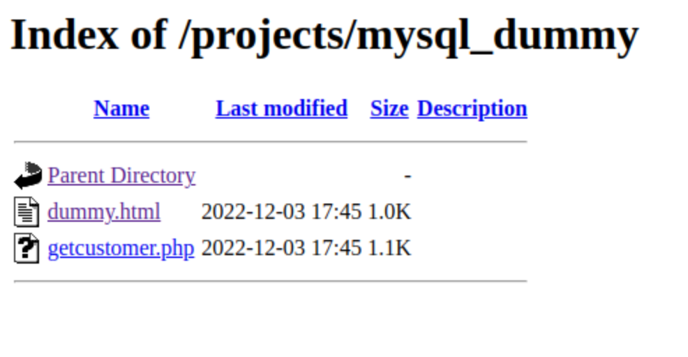
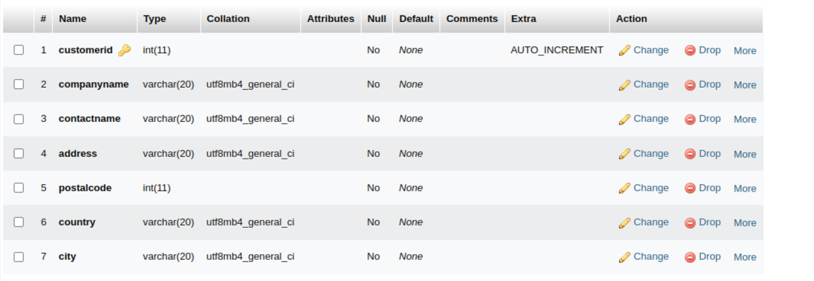
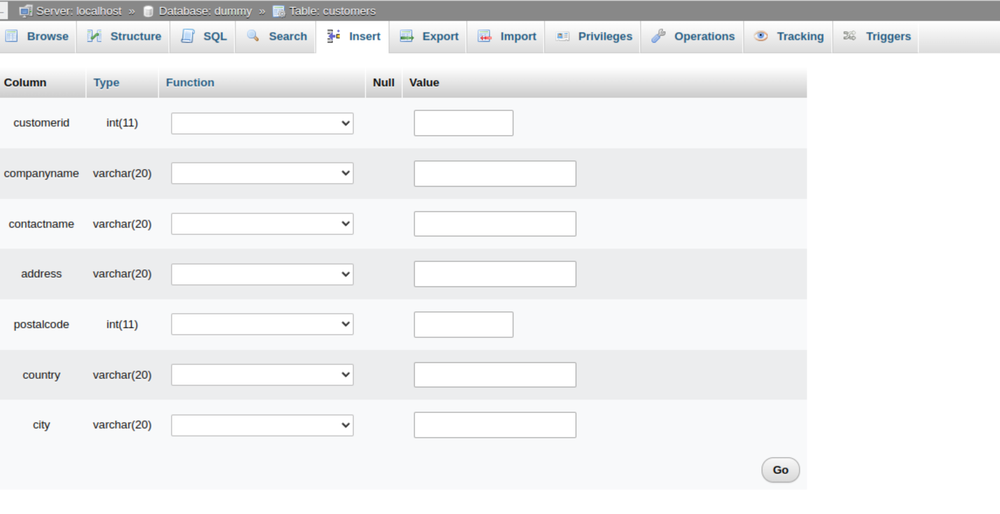
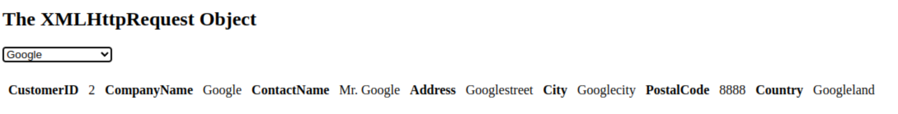

# How to run dummy example

This example shows up how to set up a MySQL database and then access the data via a .php file and visualize it in a .html file. The base data was taken from [w3shools](https://www.w3schools.com/js/js_ajax_database.asp).

## Install & start up XAMPP server

- Install [XAMPP](https://phoenixnap.com/kb/how-to-install-xampp-on-ubuntu) for Ubuntu
- Start up XAMPP server (This assumes that the XAMPP server is installed under `/opt/lampp`)

```sh
sudo /opt/lampp/manager-linux-x64.run
```

- Ensure that MySQL Database server as well as the Apache web server are running:



- Create a softlink to the `mysql_dummy` folder to the Apache data folder in your XAMPP folder

```sh
sudo ln -s $PWD/../mysql_dummy /opt/lampp/projects/
```

- Check that you can access the files with your browser at address

```sh
http://localhost/projects/mysql_dummy/
```



## Create dummy database

Once the MySQL database server is up an running you should be able to access to access the MySQL server via phpMyAdmin. To do so, enter the following address in your web browser:

```sh
http://localhost/phpmyadmin/
```

- Create new database
  Once you have opened the phpMyAdmin web interface click on New to create a new database:


- Name this database `dummy`
- After you can create a table called `customers` in this database. The details of the columns in the tables are as follows:



- Add new entries into the table by using the tab `Insert`:
  

Now you are set to access the data from above via the .html file called dummy.html.

## Access the dummy data

The data that you have filled into your dummy database can be accessed via opening up dummy.html within your webbrowser. Please ensure that you given the correct credentials of your database in getcustomer.php.

Click on now dummy.html. You should be able to select between the two added companies in the the table:


