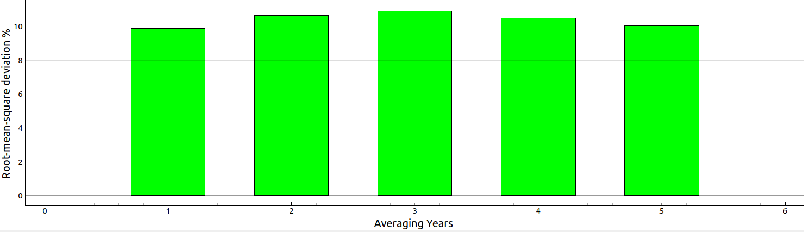

# Portfolio tracker
The goal of the portfolio tracker is to give the user the option enter his/her holdings via a .json file and it outputs different metrics e.g. dividend, dividend growth rate. Enter your holdings in the desired .json file in the same format as in the file `holdings_single.json`. Then to run the portfolio tracker run:

`python portfolio_tracker.py --holdings_file holdings_single.json`

## Installation
In order to be able to run the Python script, run:

`pip install -r requirements.txt`

`pre-commit install`

## Data source
The financial data in the tool is downloaded from Yahoo Finance via the API Python wrapper [yfinance](https://github.com/ranaroussi/yfinance). Please note, the given scripts are merely educational nature and should only used for personal usage according to the Yahoo terms of use [here](https://policies.yahoo.com/us/en/yahoo/terms/product-atos/apiforydn/index.htm), [here](https://legal.yahoo.com/us/en/yahoo/terms/otos/index.html), [here](https://policies.yahoo.com/us/en/yahoo/terms/index.htm)

## Dividend analyzer

The upper plot shows the dividend growth rate with different filter methods. There are three filtering methods available:

* Simple averaging
* Geometric averaging
* Expontential weighted averaging

The filtering considers a certain number of years on a rolling basis. Currently, you can select between 1 to 5 years for the filtering window size.

On the top menu you have a selection GUI where you can select the security, the type of the averaging and the number of years to filter respectively which plot to display in the secon figure:

The last dropdown menu allows to select the plot in the second figure. You have the following options:

* Yearl dividend paid out:

* Distribution of delta of dividend growth year over year:

* Deviation of estimates vs real measured dividend growth:

* Root-mean-square deviation for different filtering and rolling window sizes:

For more details on this topic, check out the blog entry [Estimate dividend growth rate in the future part I](https://www.finspresso.com/2022/02/19/estimate-dividend-growth-rate-in-the-future-part-i/) on finspresso.com.
