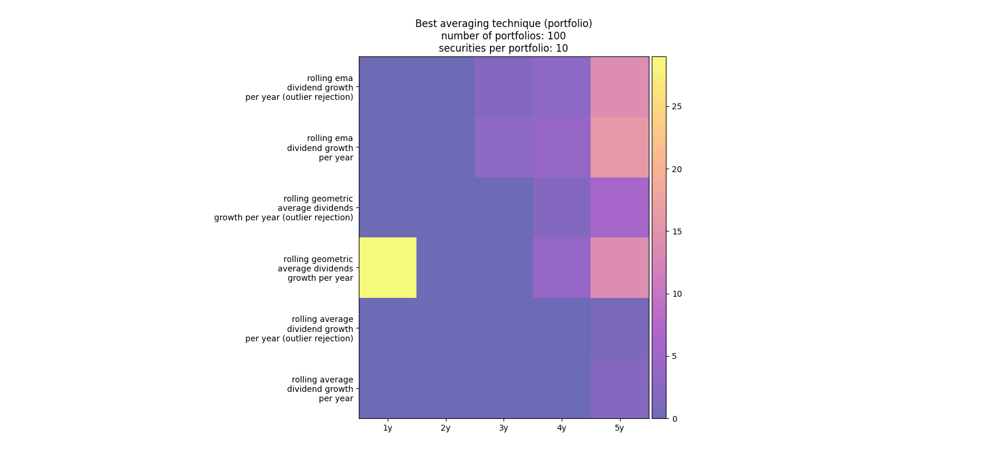
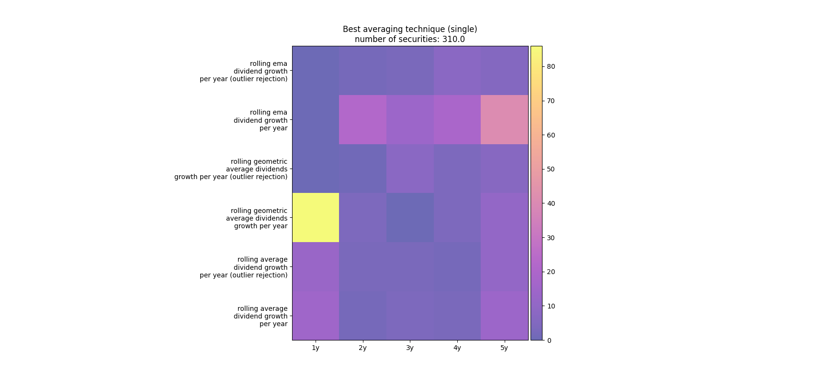

# Quant
This part of the repository allows to run some simulation over certain universe of stocks.

## Run dividend growth analysis over several portfolio
The goal of the dividend growth analysis is to compare the different dividend growth estimation techniques.

Currently, the comparison uses three different averaging techniques for comparison:

* Simple averaging
* Geometric averaging
* Exponential weighted averaging

The impact of these filtering techniques can be visualized on a security level in the [portfolio_tracker](https://github.com/finspresso/finspresso/tree/master/portfolio_tracker). As described there we consider currently rolling window sizes from 1 to 5 years.

As input variable for the analysis one can select the number of portfolios to simulate and the number of securities per portfolio. The selection universe are the stocks of the S&P 500. You can download the ticker with:

```sh
python dividend_analyzer.py --download_sp_500
```

To run the simulation, the program needs the dividend history of the input tickers in the `data_dict.json`. To download them from Yahoo finance and store them in `data_dict.json`, execute:

```sh
python dividend_analyzer.py --updates_dividends
```

The comparison uses the [root mean square deviation](https://en.wikipedia.org/wiki/Root-mean-square_deviation) from the real dividend growth to compare the different filtering techniques.

The output of the simulation is a visualization of the so-called count array as shown below. The count array is an array the contains the numbers that reflect the count of the best filtering techniques when summing over all the considered portfolios. The brighter the better the corresponding technique performed. Furthermore, we also plot the count array counting over all stocks. Please check out this [blog post](https://www.finspresso.com/2022/05/27/estimate-dividend-growth-outlier-rejection/) on [finpresso.com](www.finspresso.com) for more details on the comparison.

To get the plots as below, execute:

```sh
python dividend_analyzer.py --n_portfolio 100 --n_security 10 --outlier_rejection --save_figures
```





