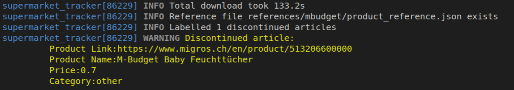

# Super market trackers

Tracks prices of selected super market.

## MBudget tracker

The Mbudget tracker tracks the different products in the Migros' MBudget line.

### Collection process

The MBudget tracker collects all the available prices that can be accessed via the mbudget protuct overview [page](https://www.migros.ch/en/brand/m-budget). Please note, the correct url is given in the config `config/mbudget.json`. This page list all the available products and there price as e.g. shown below:


To start the collection of the product type:

```sh
python supermarket_tracker.py --name mbudget --collect_products --take_screenshots
```

This does the following:

- Opens the mbudget product overview [page](https://www.migros.ch/en/brand/m-budget) using the [Selium-Python](https://selenium-python.readthedocs.io/) library in headless mode
- Extracts the price, article number and product name and stores them into an .xlsx file in the folder `data/mbudget/<Date and time of run>/mbudget_prices.xlsx`
- Compares the downloaded products with the prior state stored in the folder `references/mbudget/product_reference.json` and list which products were added and which were discontinued.
- Additionally the script takes a screenshot of every product and stores the screenshots under `data/mbudget/<Date and time of run>/`

Please note, if you use the option `--take_screenshots` the whole process takes significantly longer due to the storing of the screenshots i.e. around 140s.



### Creation of reference .json

If you have run the collection of the prices as described above the first time, you need create a file called `references/mbudget/product_sorted.xlsx`. This file is based on the .xlsx file that resides in `data/mbudget/<Date and time of run>/mbudget_prices.xlsx`. Then you need to open this file and create three more columns called `Category`, `Introduced`, `Discontinued`. The category is either `grocery` for edible items or `other`. Please insert, the day of the collection into the column `Introduced` in the format `YYYY-MM-DD`. In the column `Discontinued` the value `NA` can be filled in.


Finally, you can use the below, to create reference .json that resides `references/mbudget/product_reference.json`. This files contains the current state of the prices/product.

```sh
python supermarket_tracker.py --name mbudget --create_reference_json
```

The product_reference.json contains all relevant information per articles as shown below:


### Update of reference .json

Assuming you have already created the file `references/mbudget/product_reference.json` and have run the collection on another day, you can update `references/mbudget/product_reference.json` with the latest information by calling

```sh
python supermarket_tracker.py --name mbudget --update_reference_json data/mbudget/<Date and time of run>/mbudget_prices.xlsx
```

The script compares the content of `references/mbudget/product_reference.json` with the content of the created .xlsx file. In the end it prints which products were discontinued respectively added. Please note, you need classify the product category of the newly found product in the reference .json e.g. `other` `grocery`


### Interface to MySQL database

The data collected in the preceding steps can be stored in a MySQL database. For that to work locally on your PC, you need to install an XAMPP server as described in [here](https://github.com/finspresso/finspresso/tree/master/inflation#intall-xampp-server). Once you the MySQL database server running, you create the database `supermarket` e.g. with phpMyAdmin. Later the scripts will populate the table `mbudget_metadata` basically containing information from `references/mbudget/product_reference.json` as well as the table mbudget_prices that contains the price per article per time instances as shown below:


#### Updating metadata table

To update the metadata with the latest information from `references/mbudget/product_reference.json`, you can make the following call below. Please note, you need to provide the credentials of the MySQL database in the file `credentials/sql_credentials.json`

```sh
python supermarket_tracker.py --name mbudget --credentials_file credentials/sql_credentials.json --update_metadata_table
```

## Make .php files accessible to local XAMPP server

In order for th local XAMPP server to be able to respond to the request sent out by e.g. [mbudget_tracker.html](browser/html/mbudget_tracker.html), you need to create a softlink to all the files in the `browser/html` and `browser/php_files` folder in the XAMPP base folder (`/opt/lampp/htdocs/`):

```sh
sudo mkdir /opt/lampp/htdocs/supermarket_tracker
PROJECTS_FOLDER=<base folder of repo>
sudo ln -s $PROJECTS_FOLDER/finspresso/supermarket_tracker/browser/html /opt/lampp/htdocs/supermarket_tracker/html
sudo ln -s $PROJECTS_FOLDER/finspresso/supermarket_tracker/browser/php_files /opt/lampp/htdocs/supermarket_tracker/php_files
```

After that you should be able to open the mbudget_tracker.html with your browser e.g. with Chrome:

```sh
/opt/google/chrome/chrome http://localhost/supermarket_tracker/html/mbudget_tracker.html
```

Please note, the Apache server will not execute the .php files and respond if you directly try to open the file lik_evolution.html with your browser that resides in the repo folder. Hence, important to copy both html and php_files folder. This [entry](https://github.com/finspresso/finspresso/tree/master/inflation#intall-xampp-server) shows how to install a LAMPP server.
