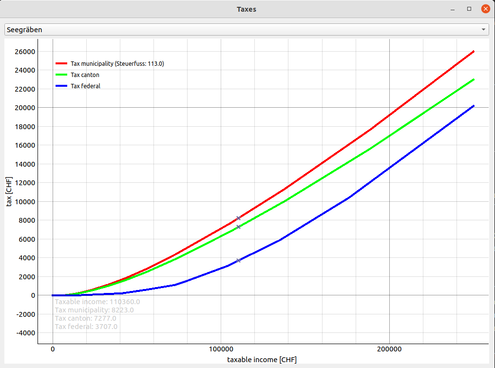

# Tax
This folder contains scripts that relate to pages with regards to taxes on www.finspresso.com.

## Installation
In order to be able to run the Python script, run:

`pip install -r requirements.txt`

`pre-commit install`

## Running the code
To run the code type:
`python withholding.py`

This will open up the default GUI as shown below. In the dropdown menu you can select the desired municipality e.g. Seegräben.

