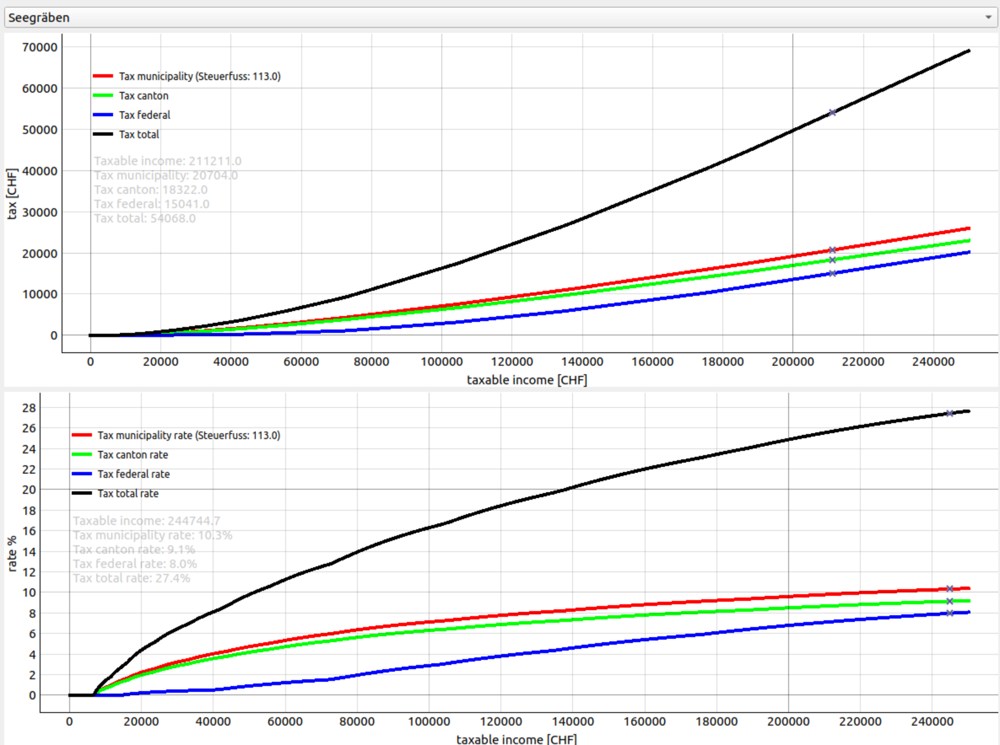

# Tax
This folder contains scripts that relate to pages with regards to taxes on www.finspresso.com. Generally, this folder contains the script to visualize the tax rate respectively the tax amount due depending on the taxable income. On top of that the visualization tools allows to select between different municipalities. On the one hand the visualization GUI is presented via pyqtgraph framework within script `withholding.py`. On the other hand the visualization can be seen in the webbrowser via `withholding.html`. More details to make it work are given below.

## Installation
In order to be able to run the Python script, run:

`pip install -r requirements.txt`

`pre-commit install`

## Running the visualization via Python pyqtgraph implementation
To run the visualization GUI from which you can see the taxes respectively the tax rate per municipality run within the pyqtgraph implemenation:
`python withholding.py`

This will open up the default GUI as shown below. In the dropdown menu you can select the desired municipality e.g. Seegräben. In the upper plot you can see how much tax you need to pay in total, for the municipality, canton and federal. In the lower plot you can see the tax rate per taxable income (x-axis).

## Running the visualization via webbrowser
To run the visualization GUI from which you can see the taxes respectively the tax rate per municipality with your webbrowser, open file with webbrowser:
`withholding.html`

Please note, in order for the webbrowser to be able to access the data in the .json files in the folder `storage_json`, you need to run a local server that serves that files via https requests. To do so, the following worked for me:

- Set up an apache server on Ubuntu PC that serves https requests. Explained in [here](https://techexpert.tips/apache/enable-https-apache/). Please note, I selected the IP address `192.168.43.60` of the apache server. If you select an other IP, you need to adapt this number in the file `withholding.html` accordingly.
- I had to set Access-Control-Allow-Origin (CORS) Headers in apache according to [this](https://ubiq.co/tech-blog/set-access-control-allow-origin-cors-headers-apache/)
- Finally, I created a soft link in the apache folder that points to the `storage_json` folder of this repo: `sudo ln -s $PWD/storage_json /var/www/html/storage_json`

Afterwards, if you open up `witholding.html` via your webbrower it should look like below. In the dropdown menu you can select the desired municipality e.g. Seegräben. In the upper plot you can see how much tax you need to pay in total, for the municipality, canton and federal. In the lower plot you can see the tax rate per taxable income (x-axis).

## Storing taxes to .json file
If you want to store all the tax data for all municipalities pf the canton of Zurich type:
`python withholding.py --json`

This will essentially create a .json file for every municipality containing the corresponding tax values per taxable income in the folder `storage_json`.
